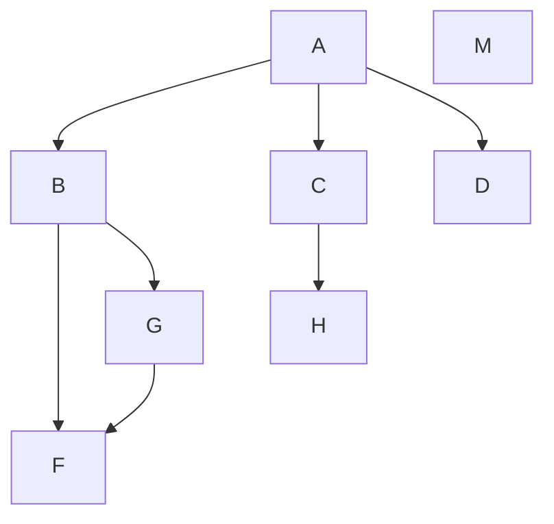
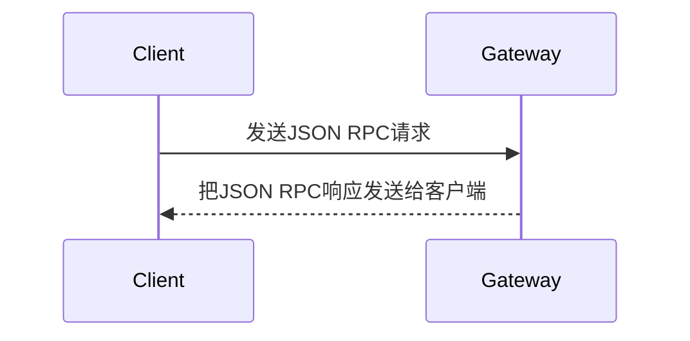

 
# 天马行空
## 想的太多
### 你才想的太多

# test
## aa

- a
- d

1. d
2. df
3. ff

> dad

> dd
> 
> d

## 表格
|商品|数量|单价|
|-|-------:|:------:|
|苹果|10|\$1|
|电脑|1|\$1000|

## 公式
 $\sum_{i=1}^n a_i=0$

## 流程图

## 时序图

