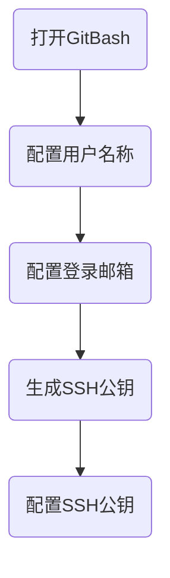
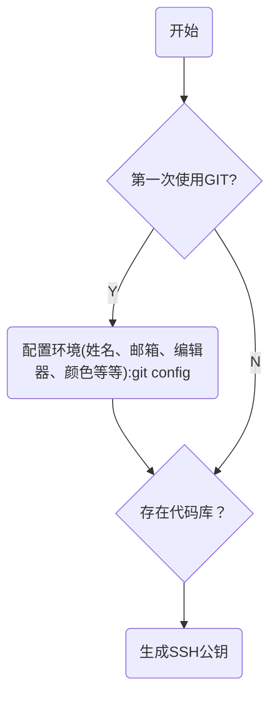
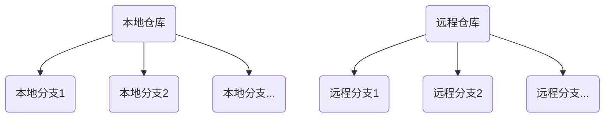

# git学习笔记（7.28）
## git安装
[下载地址](http://soft.iflytek.com/front/search?key=git&pageNo=1&pageSize=10/)

## git配置

git安装配置流程图

## git常见指令汇总
### 配置用户名称和登录邮箱：
    git config --global user.name "name"
    git config --global user.email "email"
### 生成SSH公钥： 
    ssh-keygen -t rsa -C "email"  %%生成SSH公钥
    ssh -T git@github.com  %%检查是否绑定成功
### 查看配置：
    git config --list 
### 创建仓库：
    git init %%建立一个标准的git仓库
    git init --bare <repo>  %%指定某个目录成为中心仓库
### 获取远程项目
    git clone  
###  拉取代码
    git pull  %%将服务器最新的更改获取到本地
    git pull origin master  %%将远程主机origin的master分支拉取过来与本地的brantest分支合并
    git pull <远程主机名> <远程分支名>:<本地分支名>
    (git clone 是在本地没有版本库的时候，从远程服务器克隆整个版本库到本地，是一个本地从无到有的过程。而 git pull 是将本地分支的最新提交与远程分支进行合并，以便将远程分支的更新同步到本地分支。)
### 查看更新
    git status  %%查看本地库
    git fetch origin  %%查看远程库
### 查看日志
    git log   %%查看提交历史
    git log -3  %%查看最近3次提交
    git log --oneline  
    git log --stat  %%查看提交的文件增删数量
    git log -p   %%查看详细增删
    git log -- test.txt   %%只看某个文件提交记录
### 添加文件
    git add test.txt  %%将指定文件添加到暂存区
    git add .  %%将当前目录下所有文件添加到暂存区
    git add -A  %%将所有修改过的文件添加到暂存区
    git add -u  %%将所有已跟踪的文件添加到暂存区，如果有新文件被创建或修改，则将其添加到暂存区并删除未跟踪的文件
### 提交
    git commit –m"注释"  %%提交更改到服务器
    git push origin master %%正式提交到远程的master服务器上
### checkout
    git checkout %%命令用于切换分支、恢复文件或创建新分支
    git checkout <branch>  %%切换到指定分支。例如：git checkout develop。
    git checkout -b <new_branch>  %%创建并切换到新分支。例如：git checkout -b my-feature-branch。
    git checkout -- <file>  %%从工作目录中检出指定文件。
    git checkout -- <directory>  %%从工作目录中检出指定目录及其内容。
### 分支
    git branch -r  %%查看分支
    git checkout -b <分支>  %%切换分支
    

## git其他指令汇总
git init 初始化 git，只有初始化了以后才可以使用 git 相关命令。
git clone 获取远程项目，并下载到本地。远程库的地址在 GITHUB 项目中会有提供。
git status 查看本地修改与服务器的差异。
git add . 将这些差异文件添加，这样就可以提交了。
git commit –m “这里是注释” 提交更改到服务器。
git checkout master 更改到master库。
git pull 将服务器最新的更改获取到本地。
git merge local master 将本地的local合并到远程的master上。
git push origin master 正式提交到远程的master服务器上。
git remote -v  显示当前本地仓库连接的远程仓库

## 本地仓库&&远程仓库

本地仓库

远程仓库

# GitHub使用步骤

注册账号：在 GitHub 官网上注册账号。
安装 Git:在本地计算机上安装 Git。
配置 Git:配置用户名和邮箱等信息。
创建仓库：在 GitHub 上创建一个新的仓库。
克隆仓库：将本地计算机上的代码克隆到 GitHub 仓库中。
提交更改：将本地计算机上的更改提交到 GitHub 仓库中。
推送更改：将本地计算机上的更改推送到 GitHub 仓库中。

1. 创建项目，初始化项目，并设置项目账号：
	①创建项目  D:\mermaid
	②初始化本地库  git init  (在项目当前目录下，执行命令)
		生成.git文件夹即本地仓库。
	②设置项目账号
		git config --global user.name "name"
        git config --global user.email "email"
2. 开发代码，并且进行提交操作
	git add .
	git commit -m "xxx"

## Markdown
Markdown是一种轻量级标记语言，除了编辑文字外，还支持插入图片、表格、公式，它是很流行的一种文档编辑语言，很多博客平台都支持使用Markdown来编辑文章。Markdown还有一个好用的功能是画流程图，基于Mermaid库来渲染流程图。

Mermaid 是一个基于 Javascript 的图表绘制工具，可用于创建流程图、时序图、甘特图、类图、状态图、饼图等。

Mermaid集成到了很多 Markdown 编辑器中。
