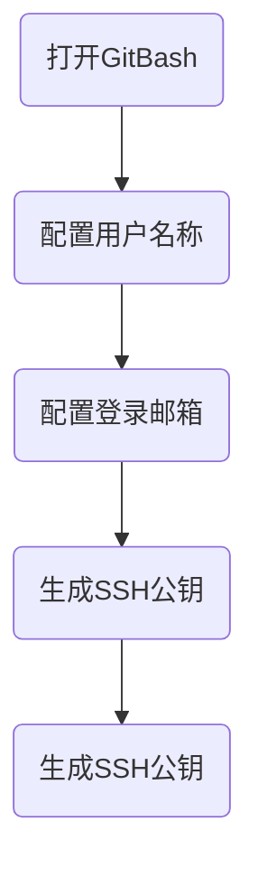

# git学习笔记（7.28）
## git安装
[下载地址](http://soft.iflytek.com/front/search?key=git&pageNo=1&pageSize=10/)

## git配置

git安装配置流程图

## git常见指令汇总
### 配置用户名称和登录邮箱：
    git config --global user.name "name"
    git config --global user.email "email"
### 生成SSH公钥： 
    ssh-keygen -t rsa -C "email"
### 查看配置：
    git config --list 

## 本地仓库&&远程仓库

## Markdown
Markdown是一种轻量级标记语言，除了编辑文字外，还支持插入图片、表格、公式，它是很流行的一种文档编辑语言，很多博客平台都支持使用Markdown来编辑文章。Markdown还有一个好用的功能是画流程图，基于Mermaid库来渲染流程图。

Mermaid 是一个基于 Javascript 的图表绘制工具，可用于创建流程图、时序图、甘特图、类图、状态图、饼图等。

Mermaid集成到了很多 Markdown 编辑器中，本文使用的是Typora编辑器，在代码块中编写Mermaid代码，编程语言名字设置为 mermaid。
